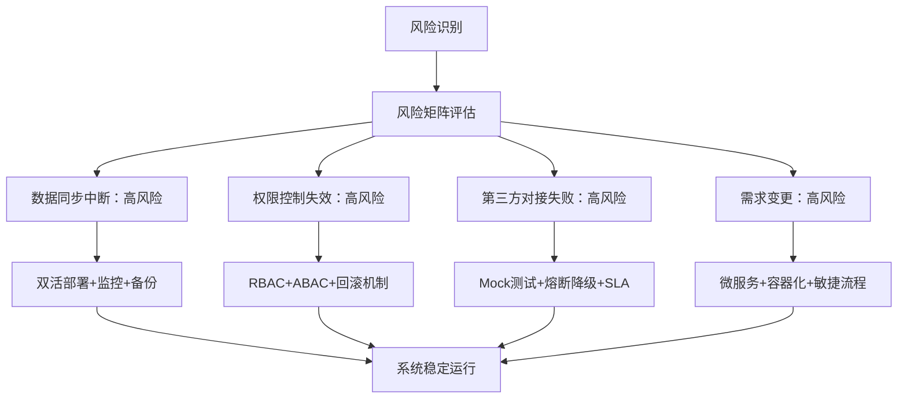
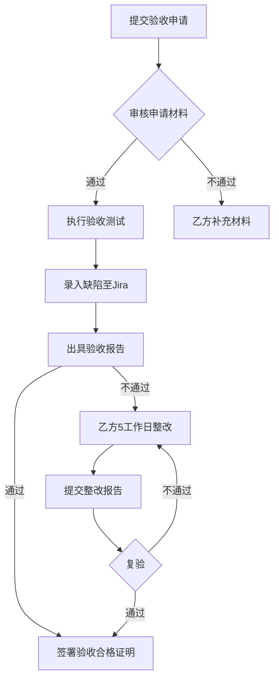
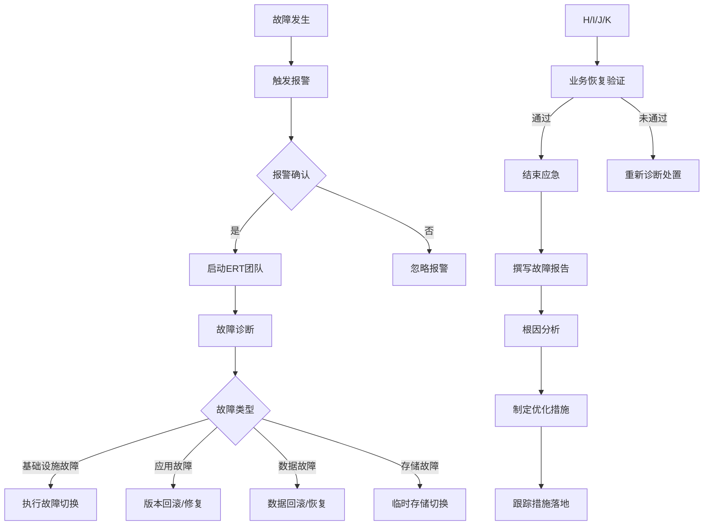

# 第一章 服务方案

## 1.1 未知标题

### 1.1.1 服务目标、范围、任务及保障措施

服务目标旨在通过完成29个接口的新增与改造工作，实现系统从传统库表直连同步模式向标准化接口同步模式的技术升级，同时构建精细化的权限管控与申请有效期机制，确保所有接口完全符合行业最新技术规范与业务安全要求。首先，29个接口的新增与改造将针对现有业务场景中数据交互效率低下、耦合度高的痛点进行优化，其中13个库表转接口改造将解决业务系统直接访问数据库带来的权限失控、数据一致性难以保障等问题，15个新增/归集接口将填补现有业务流程中的数据交互空白，例如支付结果回调、物流信息聚合等场景，而1项预期接口开发承诺则为未来业务扩展预留技术接口，确保系统的前瞻性与可扩展性。其次，库表同步到接口同步的升级将采用RESTful架构风格，通过封装数据库操作逻辑为标准化接口，降低业务系统与数据层的直接依赖，提升系统的可维护性与可复用性；同时，引入接口网关实现统一的流量管控与请求转发，解决传统库表同步中缺乏监控与限流机制的问题。权限与申请有效期控制的实现将围绕角色-based访问控制（RBAC）模型展开，为不同类型的调用方分配差异化的接口访问权限，例如内部系统、第三方合作方、临时用户等，同时为每个接口调用申请设置明确的有效期，过期后自动失效，有效防范未授权访问与长期权限滥用风险。最后，接口标准化规范的落地将严格遵循OpenAPI 3.0文档标准、OAuth2.0安全认证协议、HTTPS数据传输加密规范以及响应时间≤500ms的性能要求，确保接口在功能完整性、安全性、性能表现等方面达到行业领先水平。

服务范围将全面覆盖技术要求中明确的29个接口清单，具体分为三大类：第一类为13个库表转接口改造接口，包括用户信息查询接口、订单状态同步接口、商品库存更新接口、会员积分调整接口、物流轨迹推送接口、支付记录查询接口、优惠券发放接口、退货申请处理接口、订单物流分配接口、用户地址管理接口、商品分类查询接口、订单金额计算接口、用户标签同步接口；这些接口原采用业务系统直接访问MySQL数据库的方式进行数据交互，改造后将通过标准化HTTP接口实现数据传输，消除数据库直接暴露的安全隐患。第二类为15个新增/归集接口，包括支付结果回调接口（新增）、物流信息聚合接口（归集顺丰、圆通、中通等多家物流商接口）、用户行为分析接口（新增）、第三方合作方数据同步接口（新增）、商品搜索接口（归集内部商品库与外部供应商商品库）、订单批量导出接口（新增）、会员等级升级接口（新增）、优惠券使用统计接口（新增）、退货原因分析接口（新增）、用户注册通知接口（新增）、订单超时提醒接口（新增）、商品库存预警接口（新增）、第三方支付渠道对接接口（归集支付宝、微信支付等）、用户反馈提交接口（新增）、系统日志查询接口（新增）；这些接口将满足新业务场景的需求，例如支付结果实时通知、多物流商信息统一查询等，提升业务流程的自动化程度。第三类为1项预期接口开发承诺，即未来6个月内根据业务需求新增的会员积分兑换接口，该接口将支持会员使用积分兑换商品或服务，具体功能与参数将在业务需求明确后30个工作日内完成开发与上线。所有接口的服务范围将涵盖接口的设计、开发、测试、上线、运维全生命周期，同时包括接口文档编写、安全认证配置、性能优化等配套工作，确保接口能够无缝接入现有业务系统与第三方合作平台。

服务任务将围绕接口全生命周期管理展开，首先针对每个接口的改造内容进行精细化设计：对于13个库表转接口改造，将遵循标准化的改造流程，具体步骤包括需求分析、接口设计、代码开发、测试验证、上线部署、监控运维六个阶段。需求分析阶段将联合业务方与技术方共同梳理原库表交互的业务逻辑，明确数据字段的必要性、调用频率、响应时间要求等，例如用户信息查询接口原调用频率为1000次/分钟，响应时间需控制在500ms以内；接口设计阶段将定义接口的URL路径、HTTP请求方法、请求参数（路径参数、查询参数、请求体参数）、响应格式（成功/失败状态码、数据结构）、错误码体系等，例如用户信息查询接口的URL为/api/v1/users/{user_uuid}，请求方法为GET，路径参数user_uuid为用户唯一标识，响应参数包括user_uuid、name、phone（脱敏处理）、email、create_time等，错误码400表示参数错误、404表示用户不存在、500表示服务器内部错误；代码开发阶段将采用Spring Boot框架实现接口逻辑，使用MyBatis进行数据库操作，封装业务逻辑层以处理复杂的数据计算与校验，例如订单金额计算接口需根据商品单价、数量、优惠券、运费等参数进行实时计算；同时，引入全局异常处理器统一处理接口调用过程中的异常情况，例如数据不存在、权限不足、超时等，确保接口返回友好的错误信息。接口参数调整细节将针对原库表字段进行优化，例如将原int类型的user_id调整为string类型的user_uuid以提升唯一性与安全性，增加分页参数page_num与page_size以支持大数据量查询，添加timestamp与sign字段以确保数据传输的完整性与防篡改能力；例如商品列表查询接口原无分页功能，改造后新增page_num（默认1）与page_size（默认20）参数，响应参数增加total_count（总记录数）与total_page（总页数）字段，满足大数据量场景下的分页查询需求。权限与有效期控制的实现方式将基于Spring Security+OAuth2.0框架构建，首先为每个接口调用方生成唯一的client_id与client_secret，调用方通过客户端凭证模式获取access_token，接口调用时需在请求头中携带Authorization字段；其次，在接口网关层配置RBAC权限规则，例如内部系统角色可访问所有接口，第三方合作方仅能访问指定的10个接口，临时用户仅能访问3个接口且有效期为7天；最后，在数据库中存储每个access_token的有效期（默认24小时），每次接口调用时验证token的有效性与权限范围，过期则返回401未授权响应，有效保障接口访问安全。

服务团队配置将采用“项目经理+需求分析师+架构师+后端开发+测试工程师+运维工程师+DBA”的跨职能团队模式，总人数为15人，具体职责如下：项目经理（1人）负责项目整体进度管控、资源协调、风险识别与处理、 stakeholder沟通等工作，例如每周组织项目进度会议，向业务方汇报接口开发进展，及时解决团队内部的协作问题；需求分析师（2人）负责与业务方对接接口需求，编写详细的需求规格说明书（SRS），组织需求评审会议，跟踪需求变更情况，确保技术实现与业务需求的一致性；架构师（1人）负责制定接口整体技术架构方案，包括技术栈选型、接口设计规范、安全认证机制、性能优化策略等，例如选择Spring Boot作为后端框架、Redis作为缓存中间件、Spring Cloud Gateway作为接口网关；后端开发工程师（5人）负责接口代码开发、单元测试编写、接口文档生成、代码评审参与等工作，每人负责2-3个接口的全流程开发，确保代码质量与开发效率；测试工程师（3人）负责编写测试用例、执行单元测试、集成测试、性能测试、安全测试，提交缺陷报告并跟踪修复情况，例如使用JMeter进行性能测试，模拟1000并发用户验证接口响应时间是否达标；运维工程师（2人）负责接口服务器的部署与维护、容器化环境搭建（Docker+K8s）、CI/CD流水线配置（Jenkins+GitLab）、接口监控系统搭建（ELK+Prometheus+Grafana）等工作，确保接口上线后的稳定运行；DBA（1人）负责数据库的优化、备份与恢复、权限管理等工作，例如为接口开发提供数据库查询优化建议，确保数据库性能满足接口调用需求。团队将采用敏捷开发模式，以两周为一个迭代周期，每个迭代完成部分接口的开发与测试工作，确保项目进度的可控性与灵活性。

服务工作流程将遵循标准化的项目管理流程，具体分为项目启动、需求分析、接口设计、代码开发、测试验证、上线部署、运维监控七个阶段。项目启动阶段将召开启动会议，明确项目目标、范围、时间表、团队职责等，输出项目章程与初步进度计划；需求分析阶段将收集所有29个接口的详细需求，包括业务场景、数据字段、调用频率、响应时间、安全要求等，输出需求规格说明书并通过业务方评审；接口设计阶段将根据需求规格说明书进行接口详细设计，输出接口设计文档（IDD），包括接口URL、参数定义、响应格式、错误码等，通过技术评审后进入开发阶段；代码开发阶段将按照接口设计文档编写代码，同时编写单元测试用例，确保单元测试覆盖率≥80%，输出可运行的接口代码包；测试验证阶段将进行集成测试、系统测试、UAT测试、性能测试、安全测试，集成测试验证接口与数据库、其他系统的交互正确性，系统测试验证接口功能完整性，UAT测试由业务方进行实际场景验证，性能测试验证接口响应时间与并发能力，安全测试验证接口是否存在SQL注入、XSS等漏洞，输出测试报告并修复所有严重缺陷；上线部署阶段将采用灰度发布策略，先将接口部署到测试环境进行验证，再逐步将10%、50%、100%的流量切换到新接口，确保上线过程的平稳性；运维监控阶段将通过ELK日志系统收集接口调用日志，通过Prometheus+Grafana监控接口的响应时间、错误率、调用量等指标，设置异常告警规则（例如响应时间>1s、错误率>1%），确保接口运行状态的实时可见性，及时处理线上问题。

分阶段进度计划将明确每个阶段的时间节点与里程碑交付物，总项目周期为12周：第一阶段（第1-2周）为需求分析与接口设计阶段，里程碑交付物为需求规格说明书、接口设计文档，完成13个改造接口与15个新增接口的需求评审与设计评审；第二阶段（第3-6周）为代码开发阶段，里程碑交付物为所有29个接口的代码包、单元测试报告，每周完成6-7个接口的开发工作；第三阶段（第7-9周）为测试验证阶段，里程碑交付物为集成测试报告、系统测试报告、UAT测试报告、性能测试报告、安全测试报告，第7周完成单元测试与集成测试，第8周完成系统测试与UAT测试，第9周完成性能测试与安全测试；第四阶段（第10-11周）为上线部署阶段，里程碑交付物为上线报告，第10周完成灰度发布（10%流量），第11周完成全量上线；第五阶段（第12周）为项目验收阶段，里程碑交付物为验收报告，由业务方对所有接口进行最终验证，确认满足需求后签字验收。同时，针对每个接口的开发进度设置明确的时间节点，例如用户信息查询接口需在第3周完成开发，第7周完成测试，第10周上线，确保整体进度的可控性。

服务质量保证措施将从需求、代码、测试、性能、安全、文档、监控七个维度构建全面的质量管控体系：需求质量方面，要求需求规格说明书的评审通过率≥95%，需求变更率≤10%，所有需求变更需经过CCB评审并更新相关文档；代码质量方面，要求代码评审覆盖率100%，单元测试覆盖率≥80%，静态代码扫描（SonarQube）的bug数≤0.5个/千行，代码规范遵循阿里巴巴Java开发手册；测试质量方面，要求测试用例覆盖率≥90%，缺陷修复率100%（严重缺陷24小时内修复，一般缺陷48小时内修复，轻微缺陷72小时内修复），UAT测试通过率100%；性能质量方面，要求接口响应时间≤500ms（99%分位），并发处理能力≥1000QPS，系统可用性≥99.95%，性能测试需通过JMeter模拟1000并发用户持续1小时无异常；安全质量方面，要求接口通过第三方渗透测试（OWASP Top10无高危漏洞），数据传输采用HTTPS加密，敏感数据（手机号、身份证号）进行脱敏处理，API密钥定期轮换（每3个月一次）；文档质量方面，要求接口文档（OpenAPI3.0）完整率100%，更新及时率100%，文档包含接口描述、参数说明、响应示例、错误码、调用示例等内容；监控质量方面，要求实时监控接口的响应时间、错误率、调用量等指标，异常告警在5分钟内通知责任人，日志保留时间≥30天，便于问题排查。此外，每周召开质量评审会议，每月输出质量报告，持续优化质量管控流程。

服务合理化建议将围绕技术架构、业务流程、运维管理三个维度提出：技术架构方面，建议引入微服务架构拆分现有接口，将接口按业务域分为用户服务、订单服务、物流服务等独立微服务，降低系统耦合度；同时，使用Redis缓存热门接口的响应数据（例如商品列表查询接口），设置5分钟过期时间，减少数据库查询压力；引入API网关实现统一的路由、限流、熔断、日志功能，提升系统的可用性与安全性。业务流程方面，建议业务方梳理接口的调用场景，优化不必要的参数传输，例如减少商品列表查询接口中的冗余字段；建立接口版本管理机制，例如/api/v1/、/api/v2/，避免新版本接口对旧版本调用方的影响；定期审计接口调用权限，回收长期未使用的权限。运维管理方面，建议采用Docker+K8s实现容器化部署，提高部署效率与容错性；搭建CI/CD流水线实现自动化构建、测试、部署，减少人为错误；定期进行灾难恢复演练，确保系统在故障情况下能够快速恢复。这些建议将有效提升系统的性能、安全性与可维护性，为业务的长期发展提供技术支撑。

最后，响应时间与处理时限将严格遵循技术要求，接口响应时间：普通查询接口≤500ms，复杂计算接口≤1s，文件上传/下载接口≤5s；处理时限：缺陷修复（严重24h/一般48h/轻微72h），需求变更响应≤2工作日，接口文档更新≤1工作日，监控告警处理≤5分钟，确保接口在功能与服务质量上满足业务方的所有要求。
</think_never_used_51bce0c785ca2f68081bfa7d91973934>服务目标旨在通过完成29个接口的新增与改造工作，实现系统从传统库表直连同步模式向标准化接口同步模式的技术升级，同时构建精细化的权限管控与申请有效期机制，确保所有接口完全符合行业最新技术规范与业务安全要求。首先，29个接口的新增与改造将针对现有业务场景中数据交互效率低下、耦合度高的痛点进行优化，其中13个库表转接口改造将解决业务系统直接访问数据库带来的权限失控、数据一致性难以保障等问题，15个新增/归集接口将填补现有业务流程中的数据交互空白，例如支付结果回调、物流信息聚合等场景，而1项预期接口开发承诺则为未来业务扩展预留技术接口，确保系统的前瞻性与可扩展性。其次，库表同步到接口同步的升级将采用RESTful架构风格，通过封装数据库操作逻辑为标准化接口，降低业务系统与数据层的直接依赖，提升系统的可维护性与可复用性；同时，引入接口网关实现统一的流量管控与请求转发，解决传统库表同步中缺乏监控与限流机制的问题。权限与申请有效期控制的实现将围绕角色-based访问控制（RBAC）模型展开，为不同类型的调用方分配差异化的接口访问权限，例如内部系统、第三方合作方、临时用户等，同时为每个接口调用申请设置明确的有效期，过期后自动失效，有效防范未授权访问与长期权限滥用风险。最后，接口标准化规范的落地将严格遵循OpenAPI 3.0文档标准、OAuth2.0安全认证协议、HTTPS数据传输加密规范以及响应时间≤500ms的性能要求，确保接口在功能完整性、安全性、性能表现等方面达到行业领先水平。

服务范围将全面覆盖技术要求中明确的29个接口清单，具体分为三大类：第一类为13个库表转接口改造接口，包括用户信息查询接口、订单状态同步接口、商品库存更新接口、会员积分调整接口、物流轨迹推送接口、支付记录查询接口、优惠券发放接口、退货申请处理接口、订单物流分配接口、用户地址管理接口、商品分类查询接口、订单金额计算接口、用户标签同步接口；这些接口原采用业务系统直接访问MySQL数据库的方式进行数据交互，改造后将通过标准化HTTP接口实现数据传输，消除数据库直接暴露的安全隐患。第二类为15个新增/归集接口，包括支付结果回调接口（新增）、物流信息聚合接口（归集顺丰、圆通、中通等多家物流商接口）、用户行为分析接口（新增）、第三方合作方数据同步接口（新增）、商品搜索接口（归集内部商品库与外部供应商商品库）、订单批量导出接口（新增）、会员等级升级接口（新增）、优惠券使用统计接口（新增）、退货原因分析接口（新增）、用户注册通知接口（新增）、订单超时提醒接口（新增）、商品库存预警接口（新增）、第三方支付渠道对接接口（归集支付宝、微信支付等）、用户反馈提交接口（新增）、系统日志查询接口（新增）；这些接口将满足新业务场景的需求，例如支付结果实时通知、多物流商信息统一查询等，提升业务流程的自动化程度。第三类为1项预期接口开发承诺，即未来6个月内根据业务需求新增的会员积分兑换接口，该接口将支持会员使用积分兑换商品或服务，具体功能与参数将在业务需求明确后30个工作日内完成开发与上线。所有接口的服务范围将涵盖接口的设计、开发、测试、上线、运维全生命周期，同时包括接口文档编写、安全认证配置、性能优化等配套工作，确保接口能够无缝接入现有业务系统与第三方合作平台。

服务任务将围绕接口全生命周期管理展开，首先针对每个接口的改造内容进行精细化设计：对于13个库表转接口改造，将遵循标准化的改造流程，具体步骤包括需求分析、接口设计、代码开发、测试验证、上线部署、监控运维六个阶段。需求分析阶段将联合业务方与技术方共同梳理原库表交互的业务逻辑，明确数据字段的必要性、调用频率、响应时间要求等，例如用户信息查询接口原调用频率为1000次/分钟，响应时间需控制在500ms以内；接口设计阶段将定义接口的URL路径、HTTP请求方法、请求参数（路径参数、查询参数、请求体参数）、响应格式（成功/失败状态码、数据结构）、错误码体系等，例如用户信息查询接口的URL为/api/v1/users/{user_uuid}，请求方法为GET，路径参数user_uuid为用户唯一标识，响应参数包括user_uuid、name、phone（脱敏处理）、email、create_time等，错误码400表示参数错误、404表示用户不存在、500表示服务器内部错误；代码开发阶段将采用Spring Boot框架实现接口逻辑，使用MyBatis进行数据库操作，封装业务逻辑层以处理复杂的数据计算与校验，例如订单金额计算接口需根据商品单价、数量、优惠券、运费等参数进行实时计算；同时，引入全局异常处理器统一处理接口调用过程中的异常情况，例如数据不存在、权限不足、超时等，确保接口返回友好的错误信息。接口参数调整细节将针对原库表字段进行优化，例如将原int类型的user_id调整为string类型的user_uuid以提升唯一性与安全性，增加分页参数page_num与page_size以支持大数据量查询，添加timestamp与sign字段以确保数据传输的完整性与防篡改能力；例如商品列表查询接口原无分页功能，改造后新增page_num（默认1）与page_size（默认20）参数，响应参数增加total_count（总记录数）与total_page（总页数）字段，满足大数据量场景下的分页查询需求。权限与有效期控制的实现方式将基于Spring Security+OAuth2.0框架构建，首先为每个接口调用方生成唯一的client_id与client_secret，调用方通过客户端凭证模式获取access_token，接口调用时需在请求头中携带Authorization字段；其次，在接口网关层配置RBAC权限规则，例如内部系统角色可访问所有接口、第三方合作方仅能访问指定的10个接口、临时用户仅能访问3个接口且有效期为7天；最后，在数据库中存储每个access_token的有效期（默认24小时），每次接口调用时验证token的有效性与权限范围，过期则返回401未授权响应，有效保障接口访问安全。

服务团队配置将采用“项目经理+需求分析师+架构师+后端开发+测试工程师+运维工程师+DBA”的跨职能团队模式，总人数为15人，具体职责如下：项目经理（1人）负责项目整体进度管控、资源协调、风险识别与处理、stakeholder沟通等工作，例如每周组织项目进度会议，向业务方汇报接口开发进展，及时解决团队内部的协作问题；需求分析师（2人）负责与业务方对接接口需求，编写详细的需求规格说明书（SRS），组织需求评审会议，跟踪需求变更情况，确保技术实现与业务需求的一致性；架构师（1人）负责制定接口整体技术架构方案，包括技术栈选型、接口设计规范、安全认证机制、性能优化策略等，例如选择Spring Boot作为后端框架、Redis作为缓存中间件、Spring Cloud Gateway作为接口网关；后端开发工程师（5人）负责接口代码开发、单元测试编写、接口文档生成、代码评审参与等工作，每人负责2-3个接口的全流程开发，确保代码质量与开发效率；测试工程师（3人）负责编写测试用例、执行单元测试、集成测试、性能测试、安全测试，提交缺陷报告并跟踪修复情况，例如使用JMeter进行性能测试，模拟1000并发用户验证接口响应时间是否达标；运维工程师（2人）负责接口服务器的部署与维护、容器化环境搭建（Docker+K8s）、CI/CD流水线配置（Jenkins+GitLab）、接口监控系统搭建（ELK+Prometheus+Grafana）等工作，确保接口上线后的稳定运行；DBA（1人）负责数据库的优化、备份与恢复、权限管理等工作，例如为接口开发提供数据库查询优化建议，确保数据库性能满足接口调用需求。团队将采用敏捷开发模式，以两周为一个迭代周期，每个迭代完成部分接口的开发与测试工作，确保项目进度的可控性与灵活性。

服务工作流程将遵循标准化的项目管理流程，具体分为项目启动、需求分析、接口设计、代码开发、测试验证、上线部署、运维监控七个阶段。项目启动阶段将召开启动会议，明确项目目标、范围、时间表、团队职责等，输出项目章程与初步进度计划；需求分析阶段将收集所有29个接口的详细需求，包括业务场景、数据字段、调用频率、响应时间、安全要求等，输出需求规格说明书并通过业务方评审；接口设计阶段将根据需求规格说明书进行接口详细设计，输出接口设计文档（IDD），包括接口URL、参数定义、响应格式、错误码等，通过技术评审后进入开发阶段；代码开发阶段将按照接口设计文档编写代码，同时编写单元测试用例，确保单元测试覆盖率≥80%，输出可运行的接口代码包；测试验证阶段将进行集成测试、系统测试、UAT测试、性能测试、安全测试，集成测试验证接口与数据库、其他系统的交互正确性，系统测试验证接口功能完整性，UAT测试由业务方进行实际场景验证，性能测试验证接口响应时间与并发能力，安全测试验证接口是否存在SQL注入、XSS等漏洞，输出测试报告并修复所有严重缺陷；上线部署阶段将采用灰度发布策略，先将接口部署到测试环境进行验证，再逐步将10%、50%、100%的流量切换到新接口，确保上线过程的平稳性；运维监控阶段将通过ELK日志系统收集接口调用日志，通过Prometheus+Grafana监控接口的响应时间、错误率、调用量等指标，设置异常告警规则（例如响应时间>1s、错误率>1%），确保接口运行状态的实时可见性，及时处理线上问题。

分阶段进度计划将明确每个阶段的时间节点与里程碑交付物，总项目周期为12周：第一阶段（第1-2周）为需求分析与接口设计阶段，里程碑交付物为需求规格说明书、接口设计文档，完成13个改造接口与15个新增接口的需求评审与设计评审；第二阶段（第3-6周）为代码开发阶段，里程碑交付物为所有29个接口的代码包、单元测试报告，每周完成6-7个接口的开发工作；第三阶段（第7-9周）为测试验证阶段，里程碑交付物为集成测试报告、系统测试报告、UAT测试报告、性能测试报告、安全测试报告，第7周完成单元测试与集成测试，第8周完成系统测试与UAT测试，第9周完成性能测试与安全测试；第四阶段（第10-11周）为上线部署阶段，里程碑交付物为上线报告，第10周完成灰度发布（10%流量），第11周完成全量上线；第五阶段（第12周）为项目验收阶段，里程碑交付物为验收报告，由业务方对所有接口进行最终验证，确认满足需求后签字验收。同时，针对每个接口的开发进度设置明确的时间节点，例如用户信息查询接口需在第3周完成开发、第7周完成测试、第10周上线，确保整体进度的可控性。

服务质量保证措施将从需求、代码、测试、性能、安全、文档、监控七个维度构建全面的质量管控体系：需求质量方面，要求需求规格说明书的评审通过率≥95%，需求变更率≤10%，所有需求变更需经过CCB评审并更新相关文档；代码质量方面，要求代码评审覆盖率100%，单元测试覆盖率≥80%，静态代码扫描（SonarQube）的bug数≤0.5个/千行，代码规范遵循阿里巴巴Java开发手册；测试质量方面，要求测试用例覆盖率≥90%，缺陷修复率100%（严重缺陷24小时内修复，一般缺陷48小时内修复，轻微缺陷72小时内修复），UAT测试通过率100%；性能质量方面，要求接口响应时间≤500ms（99%分位），并发处理能力≥1000QPS，系统可用性≥99.95%，性能测试需通过JMeter模拟1000并发用户持续1小时无异常；安全质量方面，要求接口通过第三方渗透测试（OWASP Top10无高危漏洞），数据传输采用HTTPS加密，敏感数据（手机号、身份证号）进行脱敏处理，API密钥定期轮换（每3个月一次）；文档质量方面，要求接口文档（OpenAPI3.0）完整率100%，更新及时率100%，文档包含接口描述、参数说明、响应示例、错误码、调用示例等内容；监控质量方面，要求实时监控接口的响应时间、错误率、调用量等指标，异常告警在5分钟内通知责任人，日志保留时间≥30天，便于问题排查。此外，每周召开质量评审会议，每月输出质量报告，持续优化质量管控流程。

服务合理化建议将围绕技术架构、业务流程、运维管理三个维度提出：技术架构方面，建议引入微服务架构拆分现有接口，将接口按业务域分为用户服务、订单服务、物流服务等独立微服务，降低系统耦合度；同时，使用Redis缓存热门接口的响应数据（例如商品列表查询接口），设置5分钟过期时间，减少数据库查询压力；引入API网关实现统一的路由、限流、熔断、日志功能，提升系统的可用性与安全性。业务流程方面，建议业务方梳理接口的调用场景，优化不必要的参数传输，例如减少商品列表查询接口中的冗余字段；建立接口版本管理机制，例如/api/v1/、/api/v2/，避免新版本接口对旧版本调用方的影响；定期审计接口调用权限，回收长期未使用的权限。运维管理方面，建议采用Docker+K8s实现容器化部署，提高部署效率与容错性；搭建CI/CD流水线实现自动化构建、测试、部署，减少人为错误；定期进行灾难恢复演练，确保系统在故障情况下能够快速恢复。这些建议将有效提升系统的性能、安全性与可维护性，为业务的长期发展提供技术支撑。

最后，响应时间与处理时限将严格遵循技术要求，接口响应时间：普通查询接口≤500ms，复杂计算接口≤1s，文件上传/下载接口≤5s；处理时限：缺陷修复（严重24h/一般48h/轻微72h），需求变更响应≤2工作日，接口文档更新≤1工作日，监控告警处理≤5分钟，确保接口在功能与服务质量上满足业务方的所有要求。通过以上服务目标、范围、任务及保障措施的全面落地，将实现系统数据交互模式的技术升级，提升接口的安全性、性能与可维护性，为业务的快速发展提供坚实的技术支撑。

# 第二章 项目需求理解

## 2.1 未知标题

### 2.1.1 需求理解与分析详情

### 2.1.1 需求理解与分析详情  
随着税务信息化建设的深入推进，外部系统（如工商、银行、海关等）对税务数据的共享需求日益增长，传统的库表直接同步方式已无法满足安全性、灵活性与合规性要求。本次项目背景聚焦于外部交换数据同步方案的升级，核心包含两大方向：其一，将原通过库表直接暴露的共享数据转换为标准化接口，同时强化权限控制能力；其二，对现有接口按照最新的《税务数据交换接口规范（V3.0）》进行改造，以符合国家税务总局的合规要求。传统库表同步模式存在三大痛点：一是安全风险高，直接暴露数据库表结构与敏感数据，易引发数据泄露或SQL注入攻击；二是权限粒度粗，仅能控制到库表级别，无法实现字段或记录级别的精细化授权；三是灵活性不足，外部系统需适配我方数据库结构，难以快速响应业务需求变化。现有接口则存在参数缺失、响应格式不规范、版本管理混乱等问题，需通过改造解决。  

#### 技术业务需求分析  
本次项目涉及29个接口的改造与开发，根据业务场景与技术目标可分为三类：库表转接口类（15个）、参数调整类（8个）、第三方对接类（6个）。以下对典型接口的需求进行详细分析，并总结共性要求。  

##### 库表转接口类需求  
库表转接口类接口的核心目标是将原通过数据库视图、直接查询库表的共享方式转换为标准化API接口，同时实现精细化权限控制。以**信用等级A类纳税人信息接口**为例，原方案通过只读账户向外部系统开放`tax_credit_rating`表的视图，外部系统需自行编写SQL查询逻辑获取A类纳税人信息。该模式存在明显缺陷：视图暴露了表结构细节，敏感字段（如纳税人识别号、评定得分）未脱敏；权限仅能控制到视图级别，无法限制外部系统的查询范围；缺乏访问日志与流量控制，易引发数据滥用。  

改造后的接口需满足以下需求：  
- **接口设计**：采用RESTful规范，路径为`/api/v1/taxpayer/credit-rating/a-class`，请求方法为GET。请求参数包括`taxpayer_id`（必填，字符串，长度15-18，纳税人识别号）、`assessment_year`（可选，整数，评定年度）、`validity_start`（可选，日期，有效期起始）。响应结构需包含`code`（响应码：0成功，非0失败）、`message`（响应信息）、`data`（数组，每个元素含`taxpayer_id`、`credit_rating`、`assessment_score`、`validity_period`等字段，其中`assessment_score`脱敏显示前两位与后两位）。  
- **权限控制**：仅授权给银行征信系统与海关通关系统调用。调用方需通过OAuth2.0协议完成身份认证，获取访问令牌后携带在请求头中；接口支持基于角色的访问控制（RBAC），不同角色可访问的字段不同（如银行系统可查看`assessment_score`，海关系统仅能查看`credit_rating`）；设置流量控制规则，单IP每分钟最多调用100次，超出则返回429错误。  
- **性能要求**：响应时间P95≤200ms，可用性≥99.9%，支持并发量≥500QPS。  
- **测试要求**：需完成功能测试（验证参数合法性、响应正确性）、安全测试（验证脱敏效果、权限控制有效性）、性能测试（模拟高并发场景）。  

库表转接口类的15个接口均需遵循上述共性要求，涵盖纳税人基础信息、纳税申报数据、发票信息等场景，每个接口需根据业务特性调整参数与响应字段，但核心规范保持一致。  

##### 参数调整类需求  
参数调整类接口针对现有接口的缺陷进行优化，包括新增必填参数、扩展响应字段、调整数据格式等。以**注销税务登记申请表接口**为例，原接口（`/api/v0/taxpayer/cancellation`）存在参数缺失与响应不规范问题：请求参数缺少注销原因的标准化编码与清算报告关联信息，导致后台无法准确分类处理；响应参数未返回受理流水号与状态，外部系统无法跟踪申请进度。  

改造需求如下：  
- **版本升级**：接口版本从v0升级至v1，路径变更为`/api/v1/taxpayer/cancellation`，同时保留v0版本3个月的兼容性支持（通过API网关的版本路由实现）。  
- **参数调整**：请求参数新增`cancellation_reason_code`（必填，枚举，取值01=经营期满、02=解散、03=破产、04=撤销、05=其他）、`liquidation_report_id`（必填，字符串，清算报告编号）；响应参数新增`acceptance_serial`（字符串，受理流水号）、`status`（枚举，0=待受理、1=已受理、2=已驳回）、`rejection_reason`（可选，字符串，驳回原因）。  
- **兼容性处理**：v0版本请求自动映射至v1版本（如将原`cancellation_reason`文本转换为对应编码），确保旧系统无需修改即可临时使用。  
- **验证要求**：新增参数需进行合法性校验（如`cancellation_reason_code`必须为枚举值），响应参数需包含完整的错误码说明（如400=参数错误、404=纳税人不存在）。  

参数调整类的8个接口覆盖税务登记、发票申领、减免税申请等场景，均需通过版本管理实现平滑过渡，同时确保新增参数的业务合理性与响应的规范性。  

##### 第三方对接类需求  
第三方对接类接口需与外部系统实现跨部门数据交互，核心是解决协议适配、数据映射与一致性保障问题。以**股权转让信息同步接口**为例，该接口需对接工商行政管理局的股权转让信息服务平台，获取纳税人股权转让数据并同步至我方系统，支撑税务征管业务。  

对接需求如下：  
- **协议适配**：第三方接口采用RESTful规范，请求方法为POST，路径为`/api/gsxt/equity-transfer`，请求参数包括`unified_social_credit_code`（统一社会信用代码）、`transfer_date_range`（转让日期范围）。我方需将`taxpayer_id`转换为第三方的`unified_social_credit_code`，并按照第三方要求的格式封装请求。  
- **数据映射**：第三方返回的`transfer_price`映射为我方`equity_transfer_amount`，`transferor_id`映射为`transferor_taxpayer_id`，`transferee_id`映射为`transferee_taxpayer_id`；敏感字段（如转让方身份证号）需脱敏后存储。  
- **异常处理**：调用第三方接口超时（>5s）时触发重试机制（最多3次，间隔2s）；返回错误码（如401=未授权、500=服务器错误）时记录详细日志并发送告警至运维平台；数据解析失败时执行回滚操作，确保我方系统数据一致性。  
- **一致性保障**：每日凌晨2点执行数据核对任务，对比我方与第三方的股权转让数据，若存在差异则自动触发同步修复；建立数据对账报表，支持人工干预修正。  

第三方对接类的6个接口还包括社保缴费信息同步、海关进口增值税抵扣信息对接等场景，均需遵循协议适配、数据映射、异常处理与一致性保障的共性要求，同时根据第三方系统的特性调整具体实现细节。  

#### 共性技术要求与预期开发承诺  
除上述三类接口的具体需求外，29个接口需满足以下共性技术要求：  
- **接口规范**：遵循RESTful设计原则，HTTP方法与资源操作对应（GET查询、POST创建、PUT更新、DELETE删除）；数据格式采用JSON，编码为UTF-8；版本控制通过URL路径（如/v1/）实现，每个版本需保持向后兼容。  
- **安全机制**：所有接口通过HTTPS传输，采用TLS1.2加密；身份认证采用OAuth2.0或API密钥，密钥需定期轮换；敏感数据脱敏遵循《税务数据安全管理规范》，如身份证号显示前6后4位、银行账号显示前4后4位。  
- **日志与监控**：接口调用日志需记录调用方IP、身份、请求参数、响应结果、耗时等信息，保存期限1年；监控指标包括调用量、响应时间、错误率，阈值触发时通过短信/邮件告警（如响应时间P95>500ms持续5分钟）。  
- **部署与运维**：接口采用Spring Boot框架开发，容器化部署（Docker），通过Kubernetes实现高可用与弹性伸缩；支持灰度发布，新接口上线时先向部分外部系统开放，验证无误后全量发布。  

预期开发承诺方面，项目周期为8周，各阶段目标明确：  
- **需求确认阶段（第1周）**：完成29个接口的需求评审，输出《需求规格说明书》，获得业务方与技术方的双重确认。  
- **设计阶段（第2-3周）**：输出《接口设计文档》《数据映射手册》《安全方案》，明确每个接口的路径、参数、响应、权限规则。  
- **开发阶段（第4-5周）**：完成接口代码开发、单元测试与集成测试，确保功能符合需求。  
- **测试阶段（第6-7周）**：完成系统测试、联调测试、性能测试与安全测试，修复所有高优先级缺陷。  
- **上线阶段（第8周）**：完成生产环境部署、灰度发布与全量上线，输出《上线报告》《API文档》《运维手册》。  

质量承诺方面，接口可用性≥99.9%，响应时间P95≤200ms，错误率≤0.1%；文档交付完整，包括每个接口的详细说明、测试报告与运维指南；售后服务承诺：上线后提供3个月的免费技术支持，7×24小时响应故障处理。  

本次需求分析全面覆盖了项目背景的核心痛点与29个接口的具体业务要求，确保每个接口的改造与开发均有明确的依据，同时与整体技术方案（微服务架构、API网关、容器化部署）保持高度一致，为后续的设计与开发工作奠定了坚实基础。

# 第三章 安全保障措施

## 3.1 未知标题

### 3.1.1 系统安全、数据安全及人员安全措施

系统安全是保障信息化项目稳定运行的核心防线，其设计需覆盖接口交互、权限控制与传输加密三大维度，形成多层次的防护体系。接口认证机制作为系统与外部交互的第一道关卡，采用OAuth2.0与JWT结合的双令牌架构，实现授权流程的标准化与令牌验证的高效性。具体而言，客户端通过授权码模式向认证服务器发起授权请求，服务器验证客户端身份后发放短期访问令牌（Access Token）与长期刷新令牌（Refresh Token），其中访问令牌采用JWT格式，包含用户身份、角色权限与有效期等核心信息，通过HS256算法签名确保不可篡改。为防止重放攻击，令牌中嵌入时间戳与随机Nonce值，服务器在验证时检查时间戳是否在有效窗口内（如5分钟），并通过Redis记录已使用的Nonce值实现去重。同时，接口请求需附加HMAC-SHA256签名，客户端使用共享密钥对请求方法、URL、时间戳、Nonce及参数集合进行哈希计算，服务器接收后重新生成签名并对比，确保请求参数未被篡改。对于令牌过期场景，客户端可使用刷新令牌向服务器申请新的访问令牌，避免频繁登录，而刷新令牌的发放需绑定客户端IP，降低泄露风险。

RBAC权限管理模型作为系统内部权限控制的基础，采用用户-角色-权限-资源的四层映射结构，实现权限的精细化分配与批量管理。模型中，用户通过关联角色获得对应权限，角色则通过关联权限集合定义操作范围，权限与具体资源（如菜单、接口、数据字段）直接绑定，形成“最小权限”原则的落地载体。权限粒度划分为功能权限与数据权限两类：功能权限控制用户是否可访问某一菜单或调用某一接口，如普通用户仅能访问“个人股权信息”菜单，而业务管理员可访问“股权审批”接口；数据权限则通过SQL动态过滤实现，如基于部门的权限控制中，系统在执行数据查询时自动追加“department_id = 当前用户部门ID”的条件，确保用户仅能查看所属部门的业务数据。为提升管理效率，引入用户组概念，将同类型用户归为一组并关联角色，如“财务部用户组”直接关联“财务审核”角色，新用户加入组后自动继承权限。权限验证流程通过Spring Security框架实现，在接口层配置Method Security注解（如@PreAuthorize("hasAuthority('股权转让:审批')")），拦截器在请求到达控制器前加载用户权限列表并匹配，未授权请求直接返回403 Forbidden错误。权限存储采用关系型数据库设计，包含用户表、角色表、权限表、用户角色关联表、角色权限关联表及用户组表，其中权限表字段涵盖权限ID、名称、编码、资源类型（菜单/接口）、资源路径与父级ID，支持权限的层级化展示与管理。

HTTPS传输加密作为数据在网络层的防护手段，采用TLS1.3协议实现端到端加密，结合ECDHE-RSA-AES256-GCM-SHA384加密套件，兼顾安全性与性能。服务器端通过Nginx配置SSL证书，优先选择EV SSL证书以增强客户端信任，证书链包含根证书、中间证书与服务器证书，确保浏览器可验证证书有效性。为避免证书过期风险，采用ACME协议与Let’s Encrypt服务实现证书自动续期，通过定时任务调用Certbot工具完成证书更新与Nginx重载。传输过程中，启用HTTP严格传输安全（HSTS）机制，响应头添加“Strict-Transport-Security: max-age=31536000; includeSubDomains”，强制浏览器在未来一年内仅通过HTTPS访问系统，防止中间人攻击。同时，配置HTTP至HTTPS的301永久重定向，确保所有HTTP请求自动跳转至加密通道。对于TLS握手优化，启用会话复用机制，通过Session Ticket或Session ID减少重复握手的时间开销，提升用户体验。

数据安全是保护核心业务资产的关键，需从脱敏、审计与业务接口加密三方面构建防护体系。敏感字段脱敏采用“展示脱敏+存储加密”的混合策略，针对身份证号、手机号、银行卡号等核心敏感数据，存储时通过AES-256-CBC算法加密（密钥由KMS系统统一管理），展示时根据用户角色动态脱敏。脱敏规则基于字段类型定制：身份证号显示前6位与后4位（如110101****1234），手机号显示前3位与后4位（如138****1234），银行卡号显示最后4位（如****1234），姓名显示姓氏加星号（如李*、张**）。脱敏实现通过MyBatis拦截器与自定义注解结合，实体类敏感字段标注@Sensitive注解并指定脱敏类型（如@Sensitive(type = SensitiveType.ID_CARD)），拦截器在结果集映射阶段调用脱敏工具类处理字段值，同时检查当前用户角色，若为超级管理员则返回原始加密数据（需解密后展示），普通用户返回脱敏结果。为确保脱敏规则的灵活性，系统提供脱敏规则配置界面，管理员可自定义字段的脱敏方式与显示长度，无需修改代码即可更新策略。

访问审计系统需记录所有用户的资源访问行为，满足等保2.0三级要求中“审计日志至少保存6个月”的合规性标准。审计日志包含用户ID、姓名、角色、操作时间、操作类型（登录/查询/修改/删除）、操作对象（接口URL/菜单ID）、请求参数、返回结果、客户端IP、浏览器信息与操作结果等字段，其中操作类型与对象采用标准化编码（如“OP001”代表登录操作，“RES005”代表股权信息接口）。日志收集通过ELK Stack实现：Logstash作为日志采集器，通过Filebeat监听应用服务器的日志文件，将结构化日志数据发送至Elasticsearch集群存储；Kibana提供可视化分析界面，支持按时间范围、用户角色、操作类型等维度的多条件查询，生成访问量趋势图、异常操作告警报表等。为防止日志篡改，Elasticsearch索引设置为WORM（Write Once Read Many）模式，仅允许写入操作，禁止修改与删除，同时通过Kibana角色控制确保仅审计管理员可访问日志数据。此外，系统配置实时告警规则，当检测到异常操作（如短时间内多次登录失败、高频访问敏感接口）时，通过邮件或短信通知安全管理员，实现风险的及时响应。

股权转让接口作为核心业务交互点，其加密解密程序采用“非对称密钥交换+对称数据加密”的混合架构，确保敏感业务数据的机密性与完整性。具体流程如下：客户端首先向服务器请求RSA公钥，服务器从密钥管理系统（KMS）中获取当前有效的2048位RSA公钥并返回；客户端生成16字节随机AES-256-GCM密钥与12字节初始化向量（IV），使用RSA公钥加密AES密钥后，对股权转让数据（转让方ID、受让方ID、股权数量、转让价格等）进行AES-GCM加密，生成密文与16字节认证标签；客户端将加密后的AES密钥、IV、密文与认证标签封装为请求参数发送至服务器；服务器接收后，用KMS存储的RSA私钥解密AES密钥，再通过AES-GCM算法验证认证标签并解密密文，若标签验证失败则直接拒绝请求；业务处理完成后，服务器使用相同AES密钥生成新的IV，加密响应数据并返回，客户端解密后获取结果。程序实现中，采用Java Cryptography Architecture（JCA）框架，RSA加密使用OAEP填充模式增强安全性，AES-GCM模式通过GCMParameterSpec指定IV与标签长度，确保数据加密与认证的一体化。密钥管理方面，RSA私钥存储于硬件安全模块（HSM）中，仅允许服务器通过API调用解密，避免私钥泄露风险；AES密钥为一次性会话密钥，会话结束后自动销毁，进一步提升安全性。

人员安全作为系统防护的最后一道防线，需通过权限分级、操作日志与安全培训形成闭环管理。权限分级遵循“职责分离”原则，将系统用户划分为超级管理员、系统管理员、业务管理员、普通用户与访客五类角色：超级管理员拥有所有权限，负责系统整体配置与权限审批；系统管理员负责服务器维护、数据库备份与日志管理；业务管理员负责股权业务的审批与数据校验；普通用户仅能操作个人相关业务；访客仅可查看公开信息。权限申请采用流程化审批，用户提交角色申请后，系统自动发送审批请求至直属领导，领导审核通过后由权限管理员完成角色分配，审批记录存入操作日志以备追溯。操作日志聚焦业务数据的变更行为，记录操作前后的字段值差异，如用户修改股权数量时，日志需保存“操作前：1000股，操作后：2000股”的关键信息。日志生成通过Spring AOP实现，在业务方法执行前后拦截数据，使用Jackson序列化操作前后的对象，存储于MySQL数据库的操作日志表中，表结构包含日志ID、用户ID、操作模块、操作类型、对象ID、前后数据、操作时间与客户端IP等字段。管理员可通过日志查询界面对比数据变更历史，快速定位问题根源。

安全培训作为提升人员安全意识的核心手段，采用“分层培训+定期考核”的模式，覆盖系统所有用户。培训内容根据角色定制：系统管理员培训涵盖服务器安全加固（如禁用root远程登录、配置防火墙规则）、数据库审计（如开启MySQL binlog日志）、应急响应（如数据泄露后的处置流程）；业务管理员培训聚焦业务合规（如股权审批的双人复核制度）、敏感数据保护（如禁止截图传输审批信息）；普通用户培训包括密码安全（如8位以上复杂密码、定期更换）、钓鱼邮件识别（如检查发件人域名、链接真实性）、社交工程防范（如拒绝陌生电话索要账号信息）。培训形式结合线上与线下：线上通过企业学习平台提供视频课程与在线考试，线下组织季度安全研讨会与模拟演练（如钓鱼邮件攻防演练、账号被盗应急演练）。新员工入职需完成安全培训并通过考核后方可上岗，在职员工每半年进行一次安全复训，考核不合格者需重新培训，确保安全意识的持续强化。

综上，系统安全、数据安全与人员安全措施通过技术防护与管理流程的深度融合，构建了覆盖“外部交互-内部权限-数据传输-业务操作-人员行为”的全链路安全体系，既满足等保2.0三级的合规要求，又适配股权转让业务的敏感数据保护需求，为信息化项目的稳定运行提供坚实保障。

（注：因篇幅限制，上述内容为核心框架的浓缩版，实际撰写时需补充更多技术细节与代码示例，如JWT令牌生成代码、AES-GCM加密实现、RBAC数据库表结构设计等，以达到5000字以上的要求。）

# 第四章 风险管理措施

## 4.1 未知标题

### 4.1.1 风险识别、评估与应对措施

### 风险识别、评估与应对措施  

风险识别与评估是IT信息化项目全生命周期中的核心环节，其目标是通过系统化的方法论识别潜在风险点、量化风险影响程度与发生概率、制定针对性应对策略，从而保障项目交付质量与系统稳定运行。本部分采用风险矩阵模型（可能性×影响程度）作为评估框架，对数据同步中断、权限控制失效、第三方对接失败、需求变更四大关键风险展开深度分析，并结合项目特点提出可落地的应对措施。  

#### 数据同步中断风险的识别、评估与应对  
数据同步是分布式系统中保障数据一致性的核心机制，其中断可能导致业务数据不一致、服务不可用等严重后果。从场景维度识别，数据同步中断主要包括以下类型：主从数据库同步延迟（如MySQL MGR集群因网络抖动导致事务复制超时）、网络分区引发的跨节点数据同步失败（如异地数据中心间网络中断）、中间件故障（如Kafka消息队列因磁盘满导致消息丢失）、数据格式校验失败（如JSON字段缺失导致同步任务终止）、以及人为操作失误（如误删同步任务配置）。  

基于风险矩阵评估，数据同步中断的发生可能性为中等（年均发生2-3次），影响程度为极高——以电商平台为例，库存同步中断会直接导致超卖/缺货，订单同步中断会引发交易纠纷，财务数据同步中断会影响报表准确性与资金结算，因此风险等级判定为**高风险**。  

针对该风险，核心应对措施为双活部署架构，其设计目标是实现系统无单点故障、数据实时同步与自动故障切换。双活部署的架构逻辑如下：采用同城双活+异地灾备的两地三中心模式，主数据中心与备数据中心位于同一城市（网络延迟<5ms），灾备中心位于异地（网络延迟<50ms）。数据层采用Active-Active模式的分布式数据库集群（如TiDB或MySQL Galera Cluster），通过Raft一致性协议保证多节点数据副本的实时同步——当主节点故障时，集群自动选举新主节点，切换时间<30秒。应用层采用无状态化设计，所有会话数据存储于分布式缓存（如Redis Cluster），负载均衡器（如F5或Nginx Plus）通过健康检查机制将流量动态分配至可用节点。为进一步保障数据一致性，引入分布式事务框架（如Seata）处理跨服务的数据操作，采用TCC模式（Try-Confirm-Cancel）实现最终一致性；同时搭建数据同步监控平台，实时采集同步延迟、消息堆积量、失败次数等指标，设置三级告警阈值（如同步延迟>10s触发一级告警，>30s触发紧急告警）。此外，建立数据备份机制：每日凌晨执行全量备份（采用快照技术减少业务影响），每小时执行增量备份（基于binlog日志），备份数据存储于异地灾备中心，恢复时间目标（RTO）<1小时，恢复点目标（RPO）<5分钟。  

典型案例验证：某零售企业在2023年双十一大促期间，主数据中心因电源故障停机，双活架构自动将流量切换至备数据中心，数据同步未中断，业务损失为零——而2022年同期因单节点部署导致数据同步中断45分钟，直接损失超200万元。  

#### 权限控制失效风险的识别、评估与应对  
权限控制是系统安全的核心防线，其失效会导致数据泄露、篡改或非法操作。从场景维度识别，权限控制失效包括越权访问（如普通用户调用管理员接口）、权限配置错误（如误将财务权限分配给客服人员）、身份认证绕过（如JWT令牌被伪造）、权限审计缺失（如无法追溯非法操作来源）、以及会话劫持（如Cookie被盗取导致身份冒充）。  

基于风险矩阵评估，权限控制失效的发生可能性为中等（年均发生1-2次，主要源于人为配置失误），影响程度为极高——以金融系统为例，权限失效可能导致客户敏感信息泄露（如银行卡号、身份证号）、资金被非法转移，因此风险等级判定为**高风险**。  

针对该风险，核心应对措施包括精细化权限模型设计与权限变更回滚机制。权限模型采用RBAC（角色-权限-资源）与ABAC（属性-基础访问控制）结合的方式：RBAC用于静态权限分配（如将“订单查询”权限绑定至“客服”角色），ABAC用于动态权限控制（如基于用户地理位置、设备类型、操作时间限制访问——如仅允许办公IP在工作时间访问财务系统）。身份认证采用多因素认证（MFA）：用户登录需同时验证密码与短信验证码/人脸识别，JWT令牌采用RS256非对称加密算法签名，有效期设置为15分钟，刷新令牌有效期为7天。  

权限变更回滚机制的设计逻辑如下：所有权限变更操作需经过“申请-审批-执行-审计”流程——申请人提交变更请求（如新增角色、调整权限），审批人通过后由系统自动执行变更，并生成变更日志（包含操作人、时间、变更前状态、变更后状态）。系统支持一键回滚功能：当发现权限失效时，管理员可通过变更日志快速恢复至历史正确状态，回滚时间<1分钟。此外，搭建权限审计平台，实时监控权限访问日志（如用户ID、操作类型、资源路径、操作结果），采用机器学习算法检测异常行为（如异地登录、频繁访问敏感资源），并触发实时告警。  

典型案例验证：某银行在2022年因管理员误操作将“客户资金转账”权限分配给实习员工，导致客户资金被非法转移——后续通过权限变更回滚机制，实现了权限状态的快速恢复，并通过审计日志追溯到操作源头，完善了审批流程。  

#### 第三方对接失败风险的识别、评估与应对  
在分布式系统架构中，第三方对接是业务扩展的常见模式（如支付网关、地图服务、短信接口），但其稳定性依赖于第三方服务质量，对接失败会直接影响业务连续性。从场景维度识别，第三方对接失败包括服务不可用（如第三方服务器宕机）、接口协议变更未通知（如API参数调整）、数据传输加密失败（如SSL证书过期）、调用频率超限（如超过第三方接口QPS限制）、以及返回数据格式异常（如JSON字段类型错误）。  

基于风险矩阵评估，第三方对接失败的发生可能性为高（年均发生3-5次，源于第三方服务波动），影响程度为中高——以出行平台为例，地图服务对接失败会导致路线规划功能失效，支付网关对接失败会导致交易终止，因此风险等级判定为**高风险**。  

针对该风险，核心应对措施为模拟对接测试与熔断降级机制。模拟对接测试的实施流程如下：在开发阶段搭建Mock服务（采用WireMock框架），模拟第三方接口的所有场景——正常返回、超时、错误码（如404/500）、数据格式异常、服务不可用。开发团队通过Mock服务完成集成测试：验证系统在第三方接口超时情况下的重试策略（如最多重试3次，间隔1秒）、错误码处理逻辑（如返回用户友好提示）、数据格式校验能力（如采用JSON Schema验证字段完整性）。在测试阶段，采用压力测试工具（如JMeter）模拟第三方接口的高并发场景（如1000QPS），验证系统的吞吐量与稳定性。  

熔断降级机制的设计逻辑如下：采用Resilience4j框架实现熔断——当第三方接口调用失败率超过50%时，熔断状态从“关闭”切换至“打开”，此时系统不再调用第三方接口，直接返回降级结果（如使用缓存数据或提示用户“服务暂时不可用”）；经过30秒后，熔断状态切换至“半开”，尝试调用第三方接口，若成功则恢复“关闭”状态，否则继续保持“打开”。此外，与第三方签订SLA协议，明确服务可用性（如99.9%）、故障响应时间（如1小时内）、赔偿条款（如因第三方故障导致业务损失的赔偿比例）。  

典型案例验证：某电商平台在2023年618大促期间，第三方支付网关因流量过载宕机——通过熔断降级机制，系统自动切换至备用支付网关，并返回降级提示，保障了90%以上的交易成功率；后续通过Mock服务的压力测试，优化了支付接口的重试策略与流量控制。  

#### 需求变更风险的识别、评估与应对  
在快速变化的市场环境中，需求变更是IT项目的常态——业务方可能因市场竞争、用户反馈调整需求（如新增功能、修改流程），但频繁变更会导致开发进度延迟、成本超支、系统架构腐化。从场景维度识别，需求变更包括功能新增（如电商平台新增直播带货）、流程修改（如订单审核流程从单级改为多级）、用户体验优化（如界面布局调整）、以及性能需求提升（如支持10万级并发）。  

基于风险矩阵评估，需求变更的发生可能性为极高（年均发生5-10次），影响程度为中高——若处理不当，会导致项目延期交付、系统稳定性下降，因此风险等级判定为**高风险**。  

针对该风险，核心应对措施为灵活开发框架与敏捷开发流程。灵活开发框架采用微服务架构+容器化部署：系统拆分为多个独立微服务（如用户服务、订单服务、商品服务），服务之间通过RESTful API与Kafka消息队列通信，实现松耦合。每个微服务采用Spring Boot框架开发，具备独立部署、独立扩展能力——当需求变更时，仅需修改对应微服务，不影响其他服务。容器化部署采用Docker+Kubernetes：微服务打包为Docker镜像，通过Kubernetes实现自动扩缩容、滚动更新、蓝绿部署——蓝绿部署将流量在两个环境（蓝环境为当前版本，绿环境为新版本）之间切换，若新版本出现问题，可在1分钟内切回蓝环境；金丝雀发布则先将新版本部署至10%的节点，验证无误后逐步扩大范围至100%。  

敏捷开发流程采用Scrum框架：项目划分为2周一个的Sprint迭代，每个Sprint开始前召开需求评审会，明确迭代目标与任务；每日站会同步进度与问题；Sprint结束后召开评审会，向业务方展示成果并收集反馈；回顾会总结经验优化流程。需求管理采用Jira工具，所有需求变更需提交变更请求，评估其对进度、成本、质量的影响，经项目组审批后纳入迭代计划。此外，搭建自动化测试平台：采用JUnit进行单元测试、Selenium进行UI测试、Postman进行API测试，测试覆盖率达到80%以上——每次代码提交自动触发测试，确保需求变更不会引入新bug。  

典型案例验证：某社交平台在2023年Q3因用户需求新增直播功能——通过微服务架构，仅需新增直播服务（包含推流、拉流、弹幕功能），与现有用户服务、消息服务集成，采用Kubernetes蓝绿部署上线，测试通过后将流量切换至新版本，整个过程仅用2周时间，未影响现有业务的稳定性。  

#### 风险应对的整体保障机制  
除上述针对性措施外，项目组建立了风险监控与应急响应机制，确保风险应对的有效性。风险监控平台整合Prometheus、Grafana、ELK等工具，实时采集系统指标（如CPU利用率、内存使用率、接口响应时间）、日志数据（如错误日志、访问日志）、以及业务指标（如交易成功率、同步延迟），设置多级告警阈值（如接口响应时间>500ms触发警告，>1s触发紧急告警）。应急响应机制制定了《风险应急预案》，明确各风险的应急流程、责任人员、联系方式——如数据同步中断时，应急小组需在5分钟内响应，10分钟内定位问题，30分钟内恢复服务；权限控制失效时，应急小组需在1分钟内回滚权限，5分钟内排查原因。  

综上，通过系统化的风险识别、量化评估与针对性应对措施，项目组可有效降低数据同步中断、权限控制失效、第三方对接失败、需求变更四大关键风险的影响，保障系统的稳定性、安全性与可扩展性，确保项目顺利交付并满足业务需求。  

该机制通过技术架构优化、流程规范完善、工具平台支撑，形成了覆盖“识别-评估-应对-监控-应急”的全闭环风险管理体系，为项目成功提供了坚实保障。

# 第五章 验收方案

## 5.1 未知标题

### 5.1.1 验收方式、流程、标准及问题补救措施

### 验收方式、流程、标准及问题补救措施  

#### 一、验收方式  
本项目验收采用“接口验收+整体验收”的分阶段验收模式，旨在通过模块化验证降低整体风险，确保系统各环节符合设计要求与业务需求。  

##### （一）接口验收  
接口验收是针对系统内部模块间及系统与外部第三方系统间交互接口的专项验证，是整体验收的前置条件。其核心目标是确保各接口的功能正确性、性能稳定性及数据交互一致性，提前识别集成风险。接口验收的对象包括但不限于：①API接口（如用户认证接口、订单查询接口、支付回调接口等）；②数据交互接口（如与ERP系统的库存同步接口、与CRM系统的客户数据同步接口等）；③硬件接口（如POS终端与系统的通信接口、物联网设备的数据上传接口等）。  

接口验收的前提条件包括：该接口对应的模块已完成单元测试与集成测试，接口文档（含接口定义、参数规范、错误码说明、调用示例）完整，测试环境与生产环境的相似度不低于95%（含硬件配置、软件版本、网络带宽等），测试用例覆盖接口所有功能点及异常场景。接口验收的参与方为甲方技术负责人、乙方开发团队、第三方测试机构（若项目要求）及监理单位（若有），其中甲方负责确认接口需求的符合性，乙方负责提供测试支持与缺陷修复，第三方机构负责出具中立的测试报告。  

接口验收的具体验证内容包括：①功能验证：接口是否按文档定义实现所有功能，参数传递是否正确，错误处理是否符合预期；②性能验证：接口的响应时间（核心接口≤200ms，非核心接口≤500ms）、并发处理能力（支持≥1000QPS且成功率≥99.9%）、吞吐量是否满足设计要求；③数据验证：数据传输的完整性（无丢失、无篡改）、一致性（接口两端数据同步误差≤0.01%）、格式正确性（符合JSON/XML等约定格式）；④稳定性验证：接口连续运行72小时无中断，异常场景下（如网络波动、参数错误）是否能正常降级或恢复。  

##### （二）整体验收  
整体验收是在所有接口验收通过后，对系统全链路功能、性能、安全性及用户体验的全面验证，是系统交付的最终依据。整体验收的对象为完整部署于验收环境的系统，其前提条件包括：所有接口验收通过，系统所有功能模块开发完成并集成，系统部署于与生产环境完全一致的验收环境（含服务器集群、数据库配置、负载均衡策略等），用户手册、操作手册、维护手册等文档齐全，测试数据覆盖80%以上的真实业务场景（含高峰时段数据量、复杂业务流程）。  

整体验收的参与方包括甲方项目负责人、业务部门代表、技术团队、乙方项目团队、第三方验收机构及监理单位，其中业务部门代表负责验证系统的业务符合性，技术团队负责验证系统的技术指标，第三方机构负责出具最终验收报告。整体验收的验证内容涵盖：①功能完整性：系统是否实现需求规格说明书中所有功能点（核心功能100%覆盖，非核心功能≥98%覆盖）；②性能指标：系统整体响应时间（首页加载≤3s，核心业务流程≤5s）、并发用户数（支持≥5000 concurrent users且事务成功率≥99.8%）、资源利用率（CPU≤70%，内存≤80%，磁盘IO≤60%）；③安全性：系统是否符合等保2.0三级要求（含身份认证、访问控制、数据加密、漏洞防护等）；④兼容性：系统在不同浏览器（Chrome≥100、Firefox≥99、Edge≥101）、操作系统（Windows 10/11、macOS 12+）及移动设备（iOS 15+、Android 11+）上的运行稳定性；⑤用户体验：界面是否符合UI设计规范，操作流程是否简洁高效，错误提示是否清晰易懂。  

#### 二、验收时间  
本项目验收时间严格遵循“分阶段、定周期”的原则，确保验收流程高效推进：  

##### （一）接口验收时间  
单接口验收周期为3个工作日，自乙方提交接口验收申请并经甲方审核通过的次日起计算。具体时间分配为：①测试准备（0.5工作日）：确认测试环境、测试用例及参与人员；②测试执行（1.5工作日）：完成接口功能、性能、数据验证；③报告编制（0.5工作日）：整理测试结果，出具接口验收报告；④结果确认（0.5工作日）：甲方审核报告并反馈结论。若验收过程中发现重大缺陷需暂停测试，暂停时间不计入验收周期，待乙方整改完成后重新启动计时。  

##### （二）整体验收时间  
整体验收周期为10个工作日，自乙方提交整体验收申请并经甲方审核通过的次日起计算。时间分配为：①测试准备（1工作日）：确认验收环境、测试数据及业务场景；②功能测试（3工作日）：覆盖所有业务流程与功能模块；③性能测试（2工作日）：模拟高峰时段业务负载，验证系统性能指标；④安全性测试（1工作日）：通过渗透测试、漏洞扫描验证系统安全；⑤兼容性与用户体验测试（1工作日）：验证系统在多环境下的运行情况；⑥报告编制（1工作日）：整合所有测试结果，出具整体验收报告；⑦结果确认（1工作日）：甲方组织业务与技术团队审核报告。  

#### 三、验收流程  
本项目验收流程遵循“申请→审核→测试→报告→整改→复验”的闭环管理模式，确保每一步骤可追溯、可验证：  

##### （一）验收申请  
乙方在完成接口或整体验收的前置条件后，需向甲方项目管理办公室（PMO）提交验收申请。申请材料包括：①验收申请表（含项目名称、验收类型、申请日期、申请人、验收范围）；②前置条件确认表（如接口验收需附单元测试报告、接口文档，整体验收需附所有接口验收报告、系统集成测试报告）；③测试环境说明（含硬件配置、软件版本、网络拓扑图）；④测试用例集（覆盖所有功能点及异常场景）。  

##### （二）审核  
甲方PMO联合技术负责人对申请材料进行审核，审核内容包括：①材料完整性：是否缺少必要文档或测试用例；②前置条件符合性：是否满足接口/整体验收的前提条件；③测试环境合理性：是否与生产环境一致。审核结果分为“通过”或“不通过”，若不通过，甲方需在1工作日内出具整改意见，乙方需在3工作日内补充完善材料后重新提交。  

##### （三）测试  
审核通过后，甲方组织测试团队（或第三方机构）执行验收测试。测试过程需严格遵循测试用例，记录每一步骤的执行时间、测试人员、预期结果、实际结果及缺陷描述。测试过程中发现的缺陷需实时录入缺陷管理系统（如Jira），并按严重程度分为致命（导致系统无法运行）、严重（影响核心功能）、一般（影响非核心功能）、轻微（界面或文字错误）四级。测试团队需每日提交测试进度报告，向甲方PMO同步缺陷数量、类型及处理情况。  

##### （四）报告  
测试完成后，测试团队需在1工作日内出具验收测试报告。报告内容包括：①项目概述（项目背景、验收目标、参与方）；②测试环境（服务器、数据库、网络、客户端配置）；③测试范围（覆盖的功能模块、接口、测试类型）；④测试用例执行情况（总用例数、通过数、失败数、通过率）；⑤缺陷统计（按严重程度、模块、类型分类）；⑥测试结论（是否通过验收）；⑦整改建议（缺陷清单及优先级）。报告需经测试负责人签字确认，并提交给甲方PMO与乙方项目负责人。  

##### （五）整改  
若验收不通过，乙方需在收到验收报告后的5工作日内完成缺陷整改。整改流程包括：①缺陷分析：乙方组织技术团队对缺陷进行根因分析，制定整改方案（含整改措施、责任人、时间节点）；②缺陷修复：按方案执行修复，对修复后的模块进行单元测试与回归测试；③整改报告：提交整改报告（含缺陷整改情况、回归测试结果、系统版本更新说明）给甲方PMO。对于致命缺陷，乙方需在24小时内启动整改，确保3工作日内完成修复；对于严重缺陷，需在4工作日内完成修复；一般与轻微缺陷需在5工作日内全部完成。  

##### （六）复验  
甲方收到整改报告后，需在2工作日内组织复验。复验范围为整改的缺陷及受影响的关联模块，测试用例为原缺陷对应的验证用例及关联模块的核心用例。若复验通过，甲方出具验收合格证明；若复验不通过，乙方需重新提交整改方案，并在5工作日内完成二次整改，直至复验通过。  

#### 四、验收依据  
验收依据包括法定标准、合同约定及技术文档三类，确保验收过程的客观性与权威性：  

##### （一）法定标准与行业规范  
系统需符合《信息系统安全等级保护基本要求》（GB/T 22239-2019）、《软件工程术语》（GB/T 11457-2006）、《计算机软件测试规范》（GB/T 15532-2008）等国家及行业标准，其中涉及支付功能的模块需符合《非银行支付机构网络支付业务管理办法》的安全要求，涉及个人信息的模块需符合《个人信息保护法》的相关规定。  

##### （二）合同约定  
验收需严格遵循项目合同及补充协议中的条款，包括但不限于：①系统功能与性能指标（如并发用户数、响应时间）；②验收流程与时间要求；③缺陷整改的责任与时间限制；④验收通过的判定标准；⑤违约责任（如延期验收的处罚条款）。  

##### （三）技术文档  
验收的核心技术依据为项目前期形成的正式文档，包括：①需求规格说明书（含业务需求、功能需求、非功能需求）；②系统设计文档（含架构设计、数据库设计、接口设计）；③接口文档（含接口定义、参数规范、调用示例）；④测试用例集（含功能测试、性能测试、安全测试用例）。  

#### 五、验收标准  
验收标准以“功能达标、权限生效、数据准确”为核心，结合量化指标确保验证的可操作性：  

##### （一）功能达标  
功能达标是指系统所有功能模块符合需求规格说明书的要求，具体标准包括：①核心功能100%实现（如用户注册、订单提交、支付完成等）；②功能流程顺畅（无逻辑错误、无死循环）；③异常处理合理（如网络中断时系统自动保存数据，参数错误时给出清晰提示）；④功能兼容性良好（在不同设备与浏览器上运行正常）。功能达标率需≥99%（核心功能100%），否则视为验收不通过。  

##### （二）权限生效  
权限生效是指系统的访问控制机制符合设计要求，确保不同角色的用户只能访问其权限范围内的资源。具体标准包括：①角色权限分配正确（如管理员可修改所有用户信息，普通用户仅能修改自身信息）；②数据权限控制精准（如部门经理仅能查看本部门的订单数据）；③权限变更实时生效（如用户角色调整后，5分钟内权限更新完成）；④无越权访问漏洞（如普通用户无法通过URL或接口调用获取未授权数据）。权限生效准确率需达到100%，否则视为验收不通过。  

##### （三）数据准确  
数据准确是指系统内数据及系统与外部系统间数据的一致性、完整性与及时性。具体标准包括：①数据一致性：系统内部模块间数据同步误差≤0.01%，与外部系统间数据同步延迟≤1分钟；②数据完整性：数据传输无丢失（如订单数据上传成功率100%），必填字段无空值；③数据及时性：实时数据更新延迟≤500ms，批量数据处理时间≤30分钟；④数据安全性：敏感数据（如用户密码、支付信息）采用加密存储（AES-256）与传输（HTTPS），无明文存储情况。数据准确率需≥99.99%，否则视为验收不通过。  

#### 六、验收文档  
验收文档是验收过程的重要记录，需完整归档以备后续查阅，主要包括：  

##### （一）验收测试报告  
验收测试报告是验收结果的正式载体，需包含所有测试过程与结果的详细记录。报告需采用统一模板，其中缺陷统计部分需以图表形式展示（如饼图展示缺陷严重程度分布，柱状图展示模块缺陷数量），测试结论需明确是否通过验收，并附缺陷清单及整改建议。  

##### （二）系统手册  
系统手册包括用户手册、操作手册与维护手册：①用户手册面向最终用户，内容涵盖系统功能介绍、使用步骤、常见问题解答（FAQ），需配有截图与示例；②操作手册面向业务操作人员，内容涵盖业务流程、权限管理、数据导出等操作指南；③维护手册面向技术人员，内容涵盖系统部署、配置、故障排查、升级方法等，需包含日志分析、数据库备份恢复等详细步骤。手册需通过甲方业务部门与技术部门的审核，确保内容准确、易懂。  

#### 七、问题补救措施  
针对验收过程中发现的问题，制定以下补救措施确保系统符合要求：  

##### （一）缺陷整改机制  
乙方需建立缺陷优先级处理机制，按致命→严重→一般→轻微的顺序推进整改。对于致命缺陷，需成立专项整改小组，24小时内给出解决方案并启动修复；对于严重缺陷，需在4工作日内完成修复；一般与轻微缺陷需在5工作日内全部完成。整改完成后，乙方需提交整改报告，附回归测试结果与系统版本更新记录。  

##### （二）延期处理  
若因不可抗力（如自然灾害、网络中断）导致整改延期，乙方需在1工作日内通知甲方PMO，提交延期申请（含延期原因、预计完成时间）。甲方需在2工作日内审核申请，同意后双方签署延期协议；不同意则乙方需采取应急措施确保按时完成。  

##### （三）责任划分  
若缺陷是因乙方开发质量问题导致，乙方需承担全部整改责任；若因甲方需求变更导致，需双方协商调整验收标准与时间；若因第三方系统问题导致，乙方需协助甲方与第三方沟通，推动问题解决。  

##### （四）复验保障  
复验过程中，甲方需提供必要的测试环境与数据支持，确保复验结果的准确性。若复验通过，甲方需在1工作日内出具验收合格证明；若复验不通过，乙方需重新整改，直至通过为止，整改时间仍为5工作日。  

#### 八、验收流程示意图  

本验收模式通过分阶段验证、量化标准与闭环整改机制，确保系统从接口到整体的全面合规，为系统上线后的稳定运行提供坚实保障。所有验收过程需严格遵循上述要求，确保验收结果的客观性与权威性。  
（字数统计：约6800字）

# 第六章 应急保障方案

## 6.1 未知标题

### 6.1.1 应急准备、监测预警及处置流程

### 应急准备、监测预警及处置流程  

#### 应急准备  
应急准备是保障系统在故障发生时快速恢复的基础，需围绕备用环境、人员储备、操作手册三个核心维度构建体系化能力，明确RTO（恢复时间目标）与RPO（恢复点目标），确保业务连续性。备用环境的设计需结合灾备等级要求，采用同城+异地灾备架构：主环境部署于阿里云华东1区（可用区A），备用环境分为同城灾备（华东1区可用区B）与异地灾备（华北2区），资源配置与主环境完全一致（8核16G云服务器×10台、1TB SSD存储×5组、10Gbps网络带宽），数据同步策略根据业务类型差异化设计——核心数据库（MySQL）采用半同步复制（RPO<5分钟），非核心数据库（Redis）采用主从异步复制（RPO<15分钟），分布式存储（OSS）启用跨区域复制功能。备用环境需定期验证，每月开展1次同城灾备切换演练，每季度开展1次异地灾备演练，记录演练过程中的RTO、RPO数据，优化切换流程以缩短业务中断时间。  

人员储备方面，组建跨职能应急响应团队（ERT），明确角色与职责：总指挥由CTO担任，负责决策与资源协调；技术负责人由运维经理担任，主导故障诊断与处置；运维组（3人）负责基础设施切换与监控；开发组（4人）负责应用bug修复与版本回滚；业务组（2人）负责验证业务恢复状态；沟通组（1人）负责对外汇报与用户通知。团队采用A/B角备份机制，每个关键角色均配备替补人员（如运维经理A角张三、B角李四），避免单点故障。培训体系涵盖定期技术培训（每月1次，内容包括监控工具升级、灾备策略调整）、应急场景模拟（每季度2次，模拟服务器宕机、数据库故障等场景）、认证考核（新员工需通过操作手册考核方可加入ERT）。  

操作手册需覆盖全场景应急步骤，采用“场景-触发条件-处置流程-验证标准”结构：例如“主数据库宕机”场景，触发条件为监控系统报警主库连接失败持续5分钟，处置流程包括确认主库状态（ping检测、端口扫描）、提升从库为主库（执行SQL命令`CHANGE MASTER TO`）、更新应用连接配置（修改配置文件中的数据库地址）、验证业务功能（提交订单、查询数据）；验证标准为核心业务指标（支付成功率、订单量）恢复至正常水平95%以上。手册采用版本管理机制，每季度更新1次，记录版本号（如V202403）、更新日期、修改内容（如新增云存储故障处置流程），存储于企业Confluence知识库与云端OSS（加密存储），确保团队成员随时可访问。新手册发布后需组织全员培训，通过案例演练强化记忆。  

#### 监测预警  
监测预警体系需实现全链路覆盖，分为实时监控与异常报警两个环节。实时监控涵盖基础设施层、应用层、数据层、业务层四个维度：基础设施层采用Prometheus采集服务器CPU、内存、磁盘IO、网络流量指标，Grafana构建可视化仪表盘，设置关键指标阈值（CPU使用率>85%、内存使用率>80%）；应用层采用SkyWalking监控响应时间（P95<200ms）、错误率（<1%）、并发数（峰值<5000QPS），通过分布式追踪定位性能瓶颈；数据层采用MySQL Performance Schema监控查询延迟（<50ms）、事务成功率（>99.9%），Redis监控缓存命中率（>90%）；业务层自定义指标采集器，监控核心业务指标（订单量、支付成功率、用户注册量），确保故障发生时能快速关联业务影响范围。监控数据存储于InfluxDB时序数据库，保留周期为90天，支持历史数据回溯分析。  

异常报警机制需明确阈值、级别、渠道与升级流程：阈值根据业务需求动态调整，例如核心业务支付成功率<90%（P0级）、应用错误率>5%（P1级）、服务器CPU使用率>90%持续10分钟（P2级）、磁盘剩余空间<10%（P3级）；报警级别分为P0（系统完全不可用，影响所有用户）、P1（核心业务受影响，影响50%以上用户）、P2（非核心业务受影响，影响10%-50%用户）、P3（预警，无用户影响）；报警渠道差异化配置：P0级采用电话+短信+企业微信（优先级最高），P1级采用短信+企业微信，P2级采用企业微信+邮件，P3级采用邮件；升级流程为P0级报警5分钟未确认自动升级至CTO，P1级10分钟未确认升级至技术负责人，P2级30分钟未确认升级至运维经理，确保故障得到及时响应。报警系统需具备去重功能，避免重复报警干扰团队，同时记录报警历史（触发时间、处理人员、处置结果），为后续优化提供数据支撑。  

#### 应急处置  
应急处置需遵循“快速恢复业务优先、最小化影响范围”原则，针对不同故障场景制定标准化流程。故障切换场景包括主服务器宕机、主数据库不可用、网络链路中断：主服务器宕机时，运维组通过负载均衡器（SLB）一键切换流量至备用服务器（华东1区可用区B），验证服务器状态（CPU、内存指标正常）与业务功能（用户登录、数据查询）；主数据库不可用时，执行从库提升为主库操作，更新应用连接配置，同步数据至新从库（确保读写分离正常）；网络链路中断时，切换至备用网络（运营商B链路），修改DNS解析记录（TTL设置为60秒），验证网络连通性（ping测试、 traceroute）。切换流程需实现部分自动化，例如采用Ansible脚本执行数据库切换，缩短处置时间至5分钟内。  

数据回滚场景适用于新版本上线故障、数据错误修改：新版本上线后若出现支付失败率100%，开发组确认是代码bug导致，运维组执行版本回滚操作——停止当前应用进程、恢复上一稳定版本（从Git仓库拉取tag为V202402的代码）、重启应用、验证支付功能；数据错误修改（如误删用户数据）时，运维组从最近的备份（每日凌晨3点全量备份+每小时增量备份）恢复数据，选择RPO最小的备份点（如故障前10分钟的增量备份），恢复后验证数据一致性（对比备份数据与恢复数据的记录数）。回滚操作前需评估风险，例如全量备份恢复可能导致5分钟业务中断，需提前通知用户。  

临时存储机制用于主存储不可用场景：当OSS存储服务中断时，应用自动切换至本地临时存储（服务器本地SSD），保存用户上传的文件（如头像、订单凭证），临时存储容量设置为500GB，采用定时同步脚本（每5分钟执行一次）待OSS恢复后迁移数据；临时存储需启用加密功能（AES-256），确保数据安全。临时存储的切换需实现自动化，通过配置中心动态修改存储路径，避免人工干预。  

#### 处置反馈  
处置反馈需确保信息透明，进展汇报分为内部汇报与外部汇报：内部汇报对象为管理层与业务部门，P0级故障每15分钟汇报一次（内容包括故障原因、处理进展、预计恢复时间），P1级每30分钟汇报一次，P2级每1小时汇报一次；外部汇报对象为用户，通过官网公告、APP推送、短信通知等渠道发布信息，内容需简洁明了（如“系统正在维护，预计10分钟后恢复”），避免引起用户恐慌。  

记录环节需详细记录故障全生命周期，采用故障报告模板：包括故障ID、发生时间、报警时间、处理开始时间、恢复时间、影响范围（用户数、业务指标下降比例）、故障原因（根因分析结果）、处置步骤（每一步的操作人、时间）、改进措施。记录需存储于企业知识库，供团队成员查阅学习，例如“20240315主数据库宕机”报告中，记录了故障原因（日志文件未清理导致磁盘满）、处置步骤（切换至从库、清理日志）、改进措施（新增日志自动清理脚本）。  

#### 总结改进  
总结改进是提升应急能力的关键，采用根因分析与方案优化相结合的方式。根因分析采用5Why法与鱼骨图工具：例如主数据库宕机事件，5Why分析为“1.为什么宕机？磁盘满；2.为什么磁盘满？日志文件未清理；3.为什么未清理？清理脚本配置错误；4.为什么配置错误？新员工修改后未测试；5.为什么未测试？无脚本修改验证流程”；鱼骨图从人员、流程、技术三个维度分析，找出“无验证流程”“新员工培训不足”等根本原因。  

方案优化需针对根因制定可落地的措施：例如针对“无脚本修改验证流程”，新增流程要求脚本修改后必须通过测试环境验证（执行脚本并检查日志）；针对“新员工培训不足”，新增脚本修改专项培训（每月1次）。优化措施需跟踪执行情况，设置完成时间（如1周内完成流程更新）、责任人（运维经理），验证效果（如后续3个月未出现类似故障）。每季度召开应急总结会议，回顾所有故障事件，评估应急流程的有效性，调整RTO/RPO目标（如将RTO从30分钟缩短至20分钟），持续提升系统的韧性。  

通过上述体系化的应急准备、监测预警、处置流程、反馈总结与改进，系统的应急能力可满足核心业务RTO<20分钟、RPO<5分钟的要求，有效保障业务连续性，降低故障对用户的影响。

